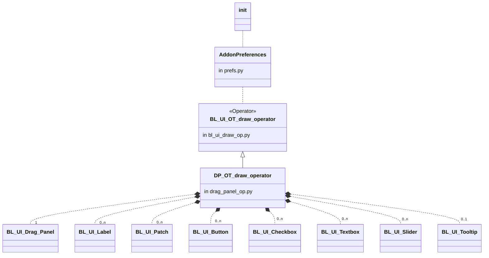
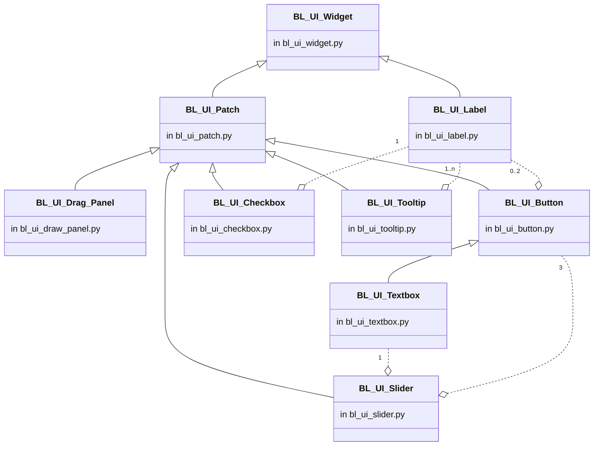

# Reference Cameras Control Panel Blender Addon

This add-on adds a new tab to Blender's N-Panel which groups many utilities for managing cameras that can be used for “fitting” the 3D models into reference photos. With it the user can easily operate multiple reference camera setups containing real world object photos taken from different directions. 

This add-on was [originally created](http://airplanes3d.net/scripts-257_e.xml) by ***Witold Jaworsky*** and has been enhanced by me with additional features and a handy floating "cameras remote control" panel built upon the [BL UI Widgets](https://github.com/jayanam/bl_ui_widgets) add-on created by ***Jayanam***. 

Feel free to create issues, file requests etc but be aware of that I may not find time to work on this as much as I'd probably like to. Note: This has been tested in Blender 2.9 (but may be back compatible to at least version 2.8)

> This fork is intended to serve as a tool set for managing the perspective view cameras in **Blender**.

## Main features

- Can be accessed via Blender's side N-Panel or via a standalone remote control **floating panel**, which can be dragged around the screen at will.
- Group of buttons to automatically set the transformation orientation and select the camera/target set in one click.
- Up to 7 camera adjustment modes for **Zoom** (dolly), **Translation** (truck & pedestal), **Rotation** (pan & roll), **Horizontal** (orbit), **Vertical** (orbit), **Tilt** and **Perspective** change.  Three different layout display options.
- Auto blinking button to turn the active meshe(s) visibility on/off (great to quickly flash the mesh against the background image helping with visual positioning accuracy).
- Memory slots that can handle up to 4 camera setup stages so that the user can easily and quickly shift among those stages to visually compare the results and decide which adjustment to keep.
- Buttons to lock target position and/or target rotation to prevent accidentally messing the camera's target.
- Buttons to add to the scene new 'camera/target sets' already configured to work with the addon.
- Camera sets can be automatically organized in distinct subgroups (per folder name, alphabetically sorted and collapsible), for easier operation.
- Buttons to temporarily remove (hide) cameras from the N-Panel group of buttons (so that it became less cluttered).
- Addon preferences panel for customization of various behaviors and elements default values.

> Note: Some functions (buttons) only appear when the 'Extended' layout option is selected in Preferences.

## Tutorial

Please visit Witold's fabulous [Airplanes in 3D Virtual Aircraft](http://airplanes3d.net/scripts-257_e.xml) site to learn **how to use** this tool and see its benefits. Also check all the awesome stuff that Witold has gotten for you in his site.

## Installation
First get the addon by clicking the green "Code" button (top right of files list above) and select the "**Download ZIP**" option, then use Blender's own "Install..." (button) option after navigating to Blender's Main Menu --> Edit --> Preferences... --> Add-ons.

## Camera modes

The standard 'adjustment camera modes' available to user selection are as follows:

**Zoom**: Dolly moves only back and forth on camera's axis (as per G + Z + move mouse)
- [x] Good to adjust 'Distance/Size'
- [x] *Characteristics - Selected: Camera; Transformation: Local; Pivot: Active Element (=Camera)*

**Horizontal Orbit**: The camera rotates around the target which stays in place (as per R + Z + move mouse)
- [x] Good to adjust 'Rotation'
- [x] *Characteristics - Selected: Camera; Transformation: Global; Pivot: 3D Cursor (which is moved to 'Target' origin)*

**Vertical Orbit**: The camera rotates around the target which stays in place (as per R + X + move mouse)
- [x] Good to adjust 'Elevation/Azimuth'
- [x] *Characteristics - Selected: Camera; Transformation: Local; Pivot: 3D Cursor (which is moved to 'Target' origin)*

**Tilt**: Camera stays still, moves from up and down (as per R + Y + move mouse)
- [x] Good to adjust 'Inclination'
- [x] *Characteristics - Selected: Target; Transformation: Local; Pivot: Active Element (=Target)*

**Translation**: Truck/Pedestal moves only from left to right on camera's axis (as per G + X/Y/Z + move mouse)
- [x] Good to adjust 'Position'
- [x] *Characteristics - Selected: Camera+Target; Transformation: Global; Pivot: Active Element (=Target)*

**Roll**: Camera stays still, lean from left to right (as per R + X/Y + move mouse)
- [x] Good to adjust 'Angle'
- [x] *Characteristics - Selected: Camera+Target; Transformation: Global; Pivot: Active Element (=Target)*

**Perspective**: combination of Camera's Translation with Elevation/Rotation (as per G + X/Y/Z + mouse move)
- [x] Good to adjust 'Point of View'
- [x] *Characteristics - Selected: Camera; Transformation: Global; Pivot: Active Element (=Target)*

## Classes relationships

